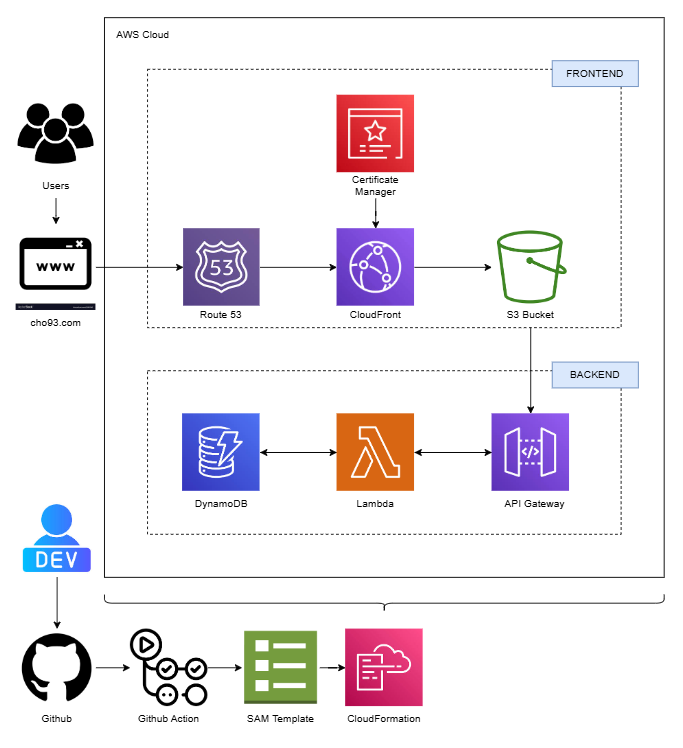
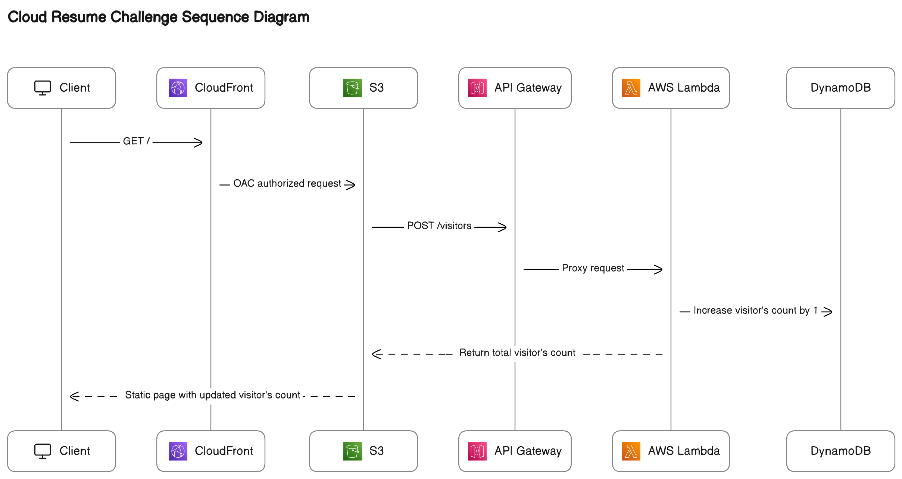

<!-- TABLE OF CONTENTS -->
<details>
  <summary>Table of Contents</summary>
  <ol>
    <li>
      <a href="#about-the-project">AWS Cloud Resume Challenge</a>
      <ul>
        <li><a href="#built-with">Built With</a></li>
      </ul>
    </li>
    <li>
      <a href="#getting-started">Getting Started</a>
      <ul>
        <li><a href="#prerequisites">Prerequisites</a></li>
        <li><a href="#installation">Installation</a></li>
      </ul>
    </li>
  </ol>
</details>

<!-- ABOUT THE PROJECT -->

## AWS Cloud Resume Challenge

This is my repo for <a href="https://cloudresumechallenge.dev/docs/the-challenge/aws/">AWS Cloud Resume Challenge</a>, created by Forrest Brazea. The project is a full-stack application that consists of a static website hosted on S3, a DynamoDB database for storing visitor counts, and a backend API powered by AWS Lambda and API Gateway to handle requests.

### Diagram



### Built With

The project incorporates the following AWS resources:

- **HTML/CSS/JavaScript** for the static website
- **Amazon S3** for hosting the static site
- **Amazon CloudFront** for distributing the website with HTTPS
- **Amazon Certificate Manager (ACM)** for provisioning SSL/TLS certificates to enable HTTPS on CloudFront
- **Amazon DynamoDB** as a NoSQL database for visitor counter
- **AWS Lambda in Java** to handle backend logic and interact with DynamoDB
- **Amazon API Gateway** to provide a REST API to the frontend
- **GitHub Actions** for continuous integration and deployment (CI/CD)
- **AWS SAM** Serverless Application Model to deploy the infrastructure as code

<!-- STAGES -->
## Challenge Stages ##

### Stage 1 - Developing Frontend ###

For the Front end, I used basic HTML, CSS, and JavaScript to create a resume page.
The Front end has been deployed by using following AWS services: 
- **Amazon S3:** The static website is hosted in an S3 bucket configured with static website hosting. I ensured all public access was blocked, and access was restricted to CloudFront.
- **Amazon Cloudfront:** CloudFront distribution is set to deliver my content through a Content Delivery Network (CDN), which improves load times and adds HTTPS security.
- **Amazon Route 53:** Custom domain cho93.com is registered with Route 53 and mapped it to the CloudFront distribution using DNS records. This ensured visitors could access the site via my custom domain.
- **AWS Certificate Manager (ACM):** SSL/TLS certificate is requested and deployed to secure the website with HTTPS. This certificate is integrated with CloudFront for seamless encryption.

### Stage 2 - Developing Backend ###

To track the number of visitors to my website, serverless backend is built, which provides a REST API to update and retrieve visitor counts. The backend components include:
- **Amazon API Gateway:** This service acts as the API's entry point, handling client requests and forwarding them to a Lambda function. It provides a single GET route, which forwards requests from the frontend to the Lambda function. This design ensures the frontend never communicates directly with DynamoDB
    #### API Workflow
    
- **AWS Lambda:** Java-based Lambda function is written to interact with DynamoDB. This function updates and retrieves the visitor count.
- **Amazon DynamoDB:** This serverless NoSQL database stores the visitor count.

### Stage 3 - CI/CD

To streamline the deployment process, CI/CD pipeline is implemented using GitHub Actions. The pipeline automates the deployment of both the backend and frontend components whenever changes are pushed to the repository: 
- ## The pipeline validates and deploys the SAM template, which provisions resources like API Gateway, Lambda, and DynamoDB.##
- ## Updates to the static website files (HTML, CSS, JavaScript) are synchronized with the S3 bucket.##
- ## CloudFront cache invalidation is triggered to ensure updated files are served immediately.##

<!-- GETTING STARTED -->

## Getting Started

### Prerequisites

Before you begin, ensure you have the following tools installed:

- **AWS CLI** - For configuring access to your AWS account.
- **AWS SAM CLI** - To build and deploy the serverless application.
- **Maven** - To build the Java Lambda function.

### Installation

1.  Clone the Repository:

    ```sh
    git clone https://github.com/rcho93/aws-cloudP.git
    cd aws-cloudP
    ```

2.  Set up AWS CLI and SAM:

    #### Install AWS CLI

    Install the AWS CLI and configure the AWS CLI by running:

    ```sh
    aws configure
    ```

    You will be prompted to enter your AWS Access Key, Secret Key, Region, and Output Format.
    Use the following details:

    - AWS Access Key ID: Provided by IAM or AWS Management Console
    - AWS Secret Access Key: Provided by IAM or AWS Management Console
    - Default region name: us-west-2
    - Default output format: json

    #### Install AWS SAM CLI

    Install the AWS SAM CLI and verify that the SAM CLI is installed correctly by running:

    ```sh
    sam --version
    ```

    This should output the SAM CLI version, indicating the installation was successful.

    #### Build and Deploy with SAM

    Build the Backend: Navigate to the backend directiry and run the following command to build the SAM application:

    ```sh
    sam build
    ```

    Deploy the Backend: Run the following command to deploy the backend resources, such as Lambda, API Gateway, and DynamoDB:

    ```sh
    sam deploy --guided
    ```

After the SAM deployment is successful, your backend is ready to handle requests!

3.  Set Up the Frontend:
    Sync the website files to your s3 bucket:
    ```sh
    aws s3 sync frontend/ s3:your-s3-bucket-name --delete
    ```
